<div align="center">


<table border="0" cellspacing="0" cellpadding="10">
<tr>
<td valign="top"></td>
<td valign="top"></td>
</tr>
</table>

[](https://www.linkedin.com/in/anushka-env)
[](mailto:anushka2967@gmail.com)
[](https://github.com/anushka-env)
[](https://leetcode.com/u/anushka_codes1107/)

<br/>

[](#)
[](#)
[](#)

<br/>


</div>

---

## 🧠 About Me

```yaml
name:       "Anushka"
role:       "Aspiring AI Engineer"
education:  "B.Tech CSE @ C.V. Raman Global University, Bhubaneswar"
standing:   "2nd Year (3rd Semester) | CGPA: 9.48"
focus:
  - "Core programming — Python, Java, C, SQL"
  - "Data Science & Machine Learning fundamentals"
  - "Generative AI & Agentic AI systems"
  - "Applied, real-world project building"
open_to:
  - "AI / Data Science internships"
  - "GenAI & Agentic AI collaborations"
  - "Research and learning-focused opportunities"
```

---

## 🛠️ Tech Stack

**Languages**

  

**Databases & Tools**

   

**AI / ML / Data Science**

[](#)
[](#)
[](#)
[](#)

**Generative & Agentic AI**

[](#)
[](#)
[](#)
[](#)

---

## 🤖 AI / Data Science Focus

| Domain | Proficiency | Details |
|---|---|---|
| Machine Learning Fundamentals | Learning | Building foundations in supervised learning, model evaluation, and data preprocessing |
| Data Science | Learning | Working with structured data using Python (NumPy, Pandas, Scikit-Learn) |
| Generative AI | Exploring | Studying prompt engineering, LLM fundamentals, and applied GenAI use cases |
| Agentic AI | Exploring | Learning agent-based workflows and how autonomous systems are designed |

---

## 🚀 Featured Projects

<details>
<summary><strong>Restaurant Ordering System</strong></summary>
<br/>

A real-world, menu-driven ordering system that models end-to-end order processing.

| Aspect | Detail |
|---|---|
| Stack | Python |
| Core Concepts | Functions, Lists & Dictionaries, Exception Handling, File Handling |
| Functionality | Persistent order storage with structured, real-world application logic |
| Repository | [github.com/anushka-env](https://github.com/anushka-env) |

</details>

<details>
<summary><strong>Library Management System</strong></summary>
<br/>

Console-based library system with borrow/return workflows and persistent records.

| Aspect | Detail |
|---|---|
| Stack | Python |
| Core Concepts | Dictionaries, Functions, File Handling, Exception Handling |
| Functionality | Borrow/return tracking with structured, persistent record management |
| Repository | [github.com/anushka-env](https://github.com/anushka-env) |

</details>

<details>
<summary><strong>Grocery Bill Calculation System</strong></summary>
<br/>

| Aspect | Detail |
|---|---|
| Stack | Python / Java |
| Core Concepts | Variables, Loops, Conditional Statements, Calculations |
| Repository | [github.com/anushka-env](https://github.com/anushka-env) |

</details>

<details>
<summary><strong>ATM Simulator</strong></summary>
<br/>

| Aspect | Detail |
|---|---|
| Stack | Python / Java |
| Core Concepts | Loops, Conditionals, Functions, Menu-driven Programming |
| Repository | [github.com/anushka-env](https://github.com/anushka-env) |

</details>

<details>
<summary><strong>Report Card Management System</strong></summary>
<br/>

| Aspect | Detail |
|---|---|
| Stack | Python / Java |
| Core Concepts | Data Handling, Percentage/Grade Calculations, Records Management |
| Repository | [github.com/anushka-env](https://github.com/anushka-env) |

</details>

---

## 🏆 Achievements

<div align="center">

| Recognition | Details |
|---|---|
| Academic Standing | CGPA 9.48 · B.Tech CSE, C.V. Raman Global University |
| Applied Project Portfolio | 5+ Python/Java projects covering real-world programming concepts |
| Consistent Growth | Actively developing skills toward AI Engineering & Data Science |

</div>

---

## 💻 Coding Profiles

<div align="center">

[](https://leetcode.com/u/anushka_codes1107/)
[](https://github.com/anushka-env)
[](https://www.linkedin.com/in/anushka-env)

</div>

---

## 📊 GitHub Analytics

<div align="center">


</div>

---

## 🏅 GitHub Trophies

<div align="center">


</div>

---

## 📈 Contribution Activity

<div align="center">


</div>

---

## 🐍 Contribution Snake

<div align="center">


</div>

---

## 🎯 Current Focus

```yaml
learning:
  - "Data Structures & Algorithms"
  - "Machine Learning & Data Science fundamentals"
  - "Generative AI & Agentic AI systems"

building:
  - "Applied Python/Java projects with real-world logic"
  - "A stronger, project-driven AI/Data Science portfolio"

open_to:
  - "AI / Data Science internships"
  - "GenAI & Agentic AI collaborations"
```

---

## 📬 Connect

<div align="center">

[](mailto:anushka2967@gmail.com)
[](https://www.linkedin.com/in/anushka-env)
[](https://github.com/anushka-env)
[](https://leetcode.com/u/anushka_codes1107/)

</div>

---

<div align="center">

*"Turning ideas into intelligent solutions, progress over perfection."*


</div>
